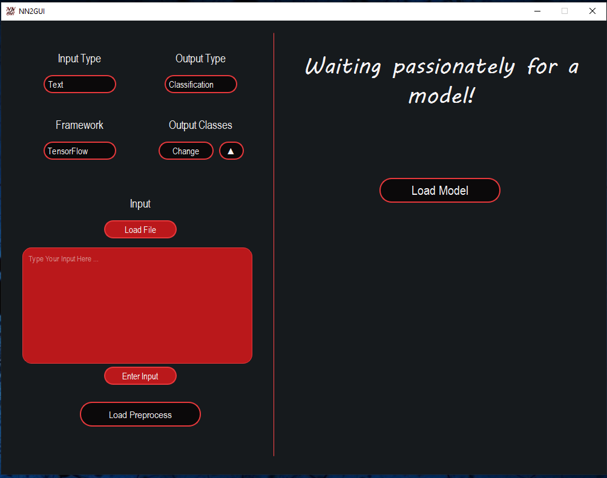
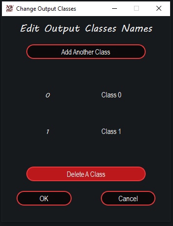
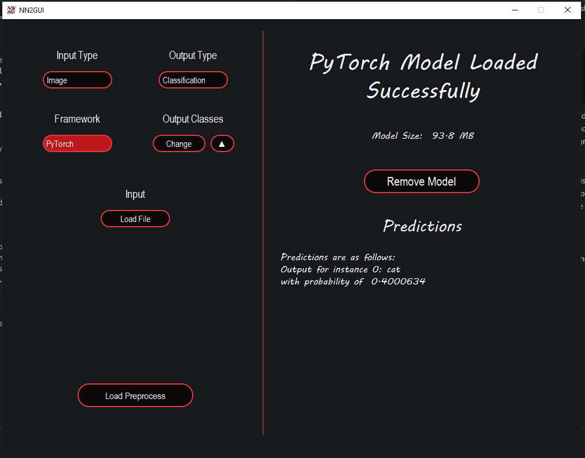

# NN2GUI
## Present Your Model In A More User-Friendly Way
NN2GUI is a tool, which is able to convert your saved (and of course trained) PyTorch or TensorFlow model to a ready to use graphical user interface. Just open NN2GUI, then show the app, where the pretrained model is located, and you have a ready-to-use GUI for your model. Simple!

## How to use NN2GUI
NN2GUI is an easy tool to use, but it might get tricky for certain applications. Here, we explain how to use this tool in the best way possible. You can see the screenshot of the main page below.
<br>
<br>
<p align="center">
  
</p>
<p align="center">Main window of the application</p>
<br>

As you can see there are multiple buttons and control widgets you can use. Let's start with the model selection.

## Load Model button
If you want to use your trained model, you should simply load it. The model could be designed by TensorFlow or PyTorch. The entire model should be saved (not only the weights), and for classification problems, it should ends with a softmax layer (not that for binary classifications, you should also use softmax). NN2GUI supports .pt files (for PyTorch), and both .h5 (old Keras models) and .pb (newer TensorFlow version) files. It is not possible to load input files or type your input, until you load a model (As it can be seen in the above screenshot, Load File button and the big edit box are disabled).

## Settings

### Input Type
Input type can be one of these options:
+ Image (Default)
+ Tabular
+ Text
+ Other

Simply, pick the one that suits your application. Changing the type helps you find your test files easier, and there is a preprocessing step for images and tabular data, if you do not provide a preprocess file, which we will cover later.

### Output type
Output type could be one of these two:
+ Regression
+ Classification (Default)

I think there is no need to expain this option more. Just to say, that NN2GUI supports these two modes for now.

### Framework
Framework can be one of these two options:
+ TensorFlow (Default)
+ PyTorch

Before picking the model file, select the framework. Loading options are different for each framework, so you should pay attention to this option.

### Output Classes
If the output type is "Classification", you can choose the names of the classes. If you choose "Regression" as the output type, this option will disappear. There are two ways to change the names of the classes. First one is to use the change button and type the names of the classes manually and by hand. In this case, if you close the application, the the setting will be deleted. The second way is to load a json file with the load button next to the change button. Let's talk about the first option. If you click on the change button, a new window will be show.
<br>
<br>
<p align="center">
  
</p>
<p align="center">The window for changing the names of the classes</p>
<br>

As you can see, it is possible to change the name of the classes. Initially there are two classes, with the names "Class 0" and "Class 1". It is possible to click on the names and change them. Also, it is possible to add another classes. There should be at least two classes, and you can delete any more classes when you reach the limit (As it can be seen in the image, "Delete A Class" button is disable, but it will be enabled, if you have more than two classes.)

The second way to update the names of the classes is to load a json file. The json file should contain a key "classes", which value is a list. In the list, you should provide the names of the classes. It should be noted, that there should be at least two items in the list, or it will not be accepted.

For example, the json file you load should be look like below:
```json
{
    "classes": [ "cat", "dog", "butterfly"]
}
```
In this example, There will be three classes, first class is "cat", second is "dog", and the third is "butterfly". The second way is more useful, when the number of classes is more than a limit that is difficult to add by hand. It should be noted, after loading the json file, it is still possible to alter the names of the classes with chagne button.

And finally, it is not necessary to name your classes, or even have many classes as the outputs of your model. Suppose you only provide three classes for NN2GUI and the model have four outputs. If the prediction of the model is the fourth one, and you didn't provide it, NN2GUI simply shows "Class 3" as the prediction (Note that counting starts from 0).

## Input Section
It is possible to load your inputs in two ways. It should be noted, that it is not possible to load inputs before loading the model. First way is to use the "Load Input" button. After selecting the input type, simply click on the "Load Input" button and select the file you want to test you model with. After loading the file, the predictions for the selected file will be shown below the "Load Model" button (See the screenshot below).
<br>
<br>
<p align="center">
  
</p>
<p align="center">Main window of the application after prediction</p>
<br>

The second way is to use the big edit box and type your input. This option is only visible when the input type is tabular or text (That's the reason you don't see it in the above screenshot). Simply, type your input and press the "Enter Input" button for a predicion. Easy!

## Preprocess
Different applications need different preprocessings. That is the reason you should provide a preprocess file. There is a case, when preprocess file is not necessary. In this case, you are using the "Load File" button, and your input type is either "Image" or "Tabular". In the "Image" case, if you haven't provide a preprocess file, the image would be read by PIL library and then converted to a tensor as the model input. In the "Tabular" case, the file be read with Pandas as it is a csv file, converted to tensor and sent to the model as input. As you can see, there is no much preprocessing on the inputs, so in most cases you have to provide one.

### How to write the preprocess file
Preprocess file should be a python file. It doesn't matter, what you name the file, but you the file should contain a preprocess function. Here is the signature of this function:
```python
def preprocess(data, flag):
    pass
    #The body of the function
```
Let's talk about flag first. the flag will be set to "False" if you use the big edit box, and set to "True", if you use the "Load Input" button. The data would be different in these two cases as well.

If you use the "Load Input" button, the data is the location of the file. Something like: C:\Users\username\Documents\Projects\NN2GUI\gallery\icon.png

If you use the big edit box, guess what would be the data? Right! The text in the box. So your preprocess file should be something like this:
```python
def preprocess(data, flag):
    # For any case
    if flag:
        #When you are using load input button
    
    # Only for Tabular and Text
    if not flag:
        #Wherer you are using the box
```


## Questions?
If you still have questions about how you should use NN2GUI, you can reach out to me via email arashheidari94@outlook.com or via linkedin https://www.linkedin.com/in/arashheidari. The other option is to open an issue. If you want to contribute to the project, you can reach out to me via the mentioned method as well.